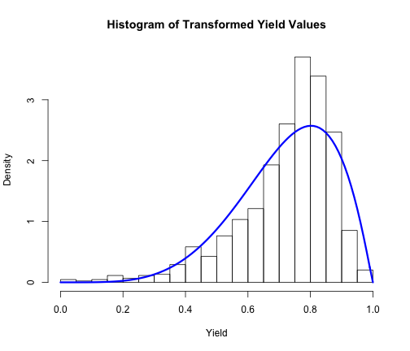
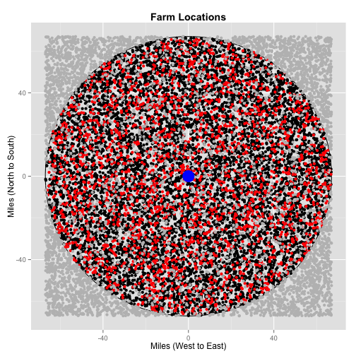

Economic Comparison of Biochemical and Thermochemical Plants
============================================================

## Feedstock Location and Availability

To provide a generalized context in which the thermochemical and biochemical processing of corn stover may be compared, a square region around a centralized plant is hypothesized.  A square region, as opposed to a circular region, is selected due to the relative ease in which it's dimensions may be fit to county level data (counties are often rectangular in shape).  However, since transportation costs play a role in plant economics, only the farms located within a given distance from the plant will ultimately be considered.

Likewise, farms which have low stover production are also not considered.  Given the high density of corn production in the areas in which biorefineries are locating, low producing farms in the region of consideration will be skipped over in favor of higher producing farms.

To demonstrate this generalization, the dimensions of the square region are tuned to the total area of north central Iowa as defined in Tyndall et al. (2011), an area of 17,963 square miles.  This selection was made due to the area's high corn production and Corn Suitability Rating (CSR), an index which rates each type of soil based on its potential row crop productivity (see figure 1).  /NOTE: modify figure in research bookmarks folder to outline NC region/   Tyndall's survey results also indicate that the farmers in this region are more willing to market their stover than other regions.

**Farms with randomly generated locations within considered area**


```r
rm(list = ls())
## Nomenclature## n: number of operations A: considered area r: radius of
## area a: acres harvested per operation theta: Bernoulli distribution
## parameter

# Assumptions
n = 15872  #tuned to the number of operations in North Central Iowa in 2012 according to NASS
A = 17963  #tuned to area of North Central Iowa as defined by Tyndall
theta = 0.23  #parameter for Bernoulli distribution

# Implied variables
r = sqrt(A)/2

# Randomly generating farms
farms <- matrix(data = NA, nrow = n, 4)
colnames(farms) <- c("ID", "XCoord", "YCoord", "Distance")

for (i in 1:n) {
    farms[i, 1] <- i
    farms[i, 2] <- runif(1, -r, r)
    farms[i, 3] <- runif(1, -r, r)
}

farms <- as.data.frame(farms)
farms$Distance <- sqrt(farms$XCoord^2 + farms$YCoord^2)
```


**Method of Moments estimation of the distribution of Iowa yields**

Stover production can be estimated through use of a harvest index (weight of grain as a proportion of total crop weight) which relates the production value to the grain yield.  Since yields have spatial variation, so too will stover production.  To capture this variation, a yield distribution is needed.  Here, we assume that yields,y,follow a transformed beta distribution and is modelled through the use of $\frac{x-y_{min}}{y_{max}-y_{min}}$ where $x \sim beta(\alpha,\beta)$.  The parameters and support of this distribution follow from a method of moments approach using 2004-2013 yield data for the state of Iowa.


```r
# reading in the data
c <- "/Users/goodrich/Desktop/R Projects/Supply.Chain.Development/Iowa_corn_data_2.csv"
iowa.data <- read.table(file = c, header = TRUE, sep = ",")

# extracting yield data from 2004-2013
iowa.yield <- subset(iowa.data, Data.Item == "CORN, GRAIN - YIELD, MEASURED IN BU / ACRE")
iowa.yield <- subset(iowa.yield, Year > 2004)
iowa.yield <- subset(iowa.yield, select = c(Year, County, Value))

# converting values to numeric
iowa.yield$Value <- as.numeric(as.character(iowa.yield$Value))

# calculating the support of yield variable
l <- min(iowa.yield$Value)
u <- max(iowa.yield$Value)

# transform data to standard beta distribution
iowa.yield$trans <- (iowa.yield$Value - l)/(u - l)

# method of moments estimation
mu <- mean(iowa.yield$trans)
s2 <- var(iowa.yield$trans)
beta <- mu * (1 - mu)^2/s2 - (1 - mu)
alpha <- beta * mu/(1 - mu)

hist(iowa.yield$trans, breaks = 16, main = "Histogram of Transformed Yield Values", 
    freq = FALSE, xlab = "Yield")
curve(dbeta(x, alpha, beta), add = TRUE, col = "blue", lwd = 3)
```

 


**Corn Stover Production**

Corn stover production then follows from a simplified version of the equation found in Graham et al. (2007): 

EQUATION 1:
Stover (kg per acre per year) = yield (bu corn per acre per year) 
                                * avg dry grain mass of a bushel of corn (kg corn per bu) 
                                * (1-dry weight harvest index) / dry weight harvest index

/Note:  This is a common assumption but R.L. Hoskinson et al. (2007) suggests that a better estimation technique uses the collected stover harvest index rather than the dry weight harvest index since mechanically speaking, it is impossible to collect the entire plant.  They report values of 0.60 and 0.66 for low (10 cm above soil) and normal (40 cm above soil) cutting techniques./


```r
# Stover production per acre
stover.acre = function(yield, dgm, HI) {
    yield * dgm * HI/(1 - HI)
}

# Assumptions
dgm <- 21.5  #kg/bu from Wilcke and Wyatt (2002)
HI <- 0.5  #ratio of grain mass to total plant mass from Gupta (1979), DuPont discussion

# Generating Yields
farms$AvgYield <- 0
for (i in 1:nrow(farms)) {
    farms[i, 5] <- l + (u - l) * rbeta(1, alpha, beta)
}

# Calculating average stover production
farms$AvgStover <- 0
for (i in 1:nrow(farms)) {
    farms[i, 6] <- stover.acre(farms[i, 5], dgm, HI)
}
```


Assume that biorefinery will only consider farms with an average stover production of greater than 3 tons per acre (2721.555 kg).


```r
# Assumptions
stover.requirement <- 2721.55  #kg per acre required for consideration

# Selecting only farms within given radius around the centralized plant
farms.considered <- subset(farms, Distance < r)

# Partitioning out only farms which reach the stover production requirement
farms.considered <- subset(farms.considered, farms.considered$AvgStover > stover.requirement)

# Partitioning out the farms which have agreed to provide their stover
farms.considered$Participate <- 0
for (i in 1:nrow(farms.considered)) {
    farms.considered[i, 7] <- rbinom(1, 1, theta)
}
part.farms <- subset(farms.considered, Participate == 1)
```


**Depiction of considered area and participating farms**

The number of farms generated are set to match the number of corn operations in North Central Iowa in 2012, 15,872.  However, of these 15,872 corn operations, only a certain proportion of those in consideration will agree to provide their stover to the plant.  Due to the uncertainty of how much stover can be removed from the field without negatively impacting yields and long-term soil productivity, farmers have varying levels of comfort with allowing a biorefinery to harvest their stover.  From the standpoint of the biorefinery, whether a farmer will agree to participate is uncertain.  To capture this uncertainty, a farmer's willingness to participate is assumed to follow a Bernoulli($\theta$) distribution with $\theta$ tuned to 0.23 to reflect the results of Tyndall's survey paper.


```r
require(ggplot2)
```

```
## Loading required package: ggplot2
```

```r

## Partitioning out non-participating farms##
nonpart.farms <- subset(farms.considered, Participate == 0)

## Partitioning out farms not considered
nonconsidered.farms <- subset(farms, Distance > r | AvgStover < stover.requirement)

## Creating array for biorefinery location##
refine.locations <- matrix(data = NA, nrow = 1, 3)
colnames(refine.locations) <- c("Site", "XCoord", "YCoord")
refine.locations <- as.data.frame(refine.locations)
refine.locations[1, 1] <- "Central Facility"
refine.locations[1, 2] <- 0
refine.locations[1, 3] <- 0

## Drawing the circle##
circleFun <- function(center = c(0, 0), diameter = 1, npoints = 10000) {
    rr = diameter/2
    tt <- seq(0, 2 * pi, length.out = npoints)
    xx <- center[1] + rr * cos(tt)
    yy <- center[2] + rr * sin(tt)
    return(data.frame(x = xx, y = yy))
}

circle <- circleFun(c(0, 0), 2 * r, npoints = n)
# geom_path will do open circles, geom_polygon will do filled circles
ggplot(circle, aes(x, y)) + geom_path() + geom_point(data = nonpart.farms, x = nonpart.farms$XCoord, 
    y = nonpart.farms$YCoord) + geom_point(data = part.farms, x = part.farms$XCoord, 
    y = part.farms$YCoord, col = "red") + geom_point(data = nonconsidered.farms, 
    x = nonconsidered.farms$XCoord, y = nonconsidered.farms$YCoord, col = "gray") + 
    geom_point(data = refine.locations, x = refine.locations$XCoord, y = refine.locations$YCoord, 
        col = "blue", size = 8) + ggtitle("Farm Locations") + theme(plot.title = element_text(lineheight = 0.8, 
    face = "bold")) + xlab("Miles (West to East)") + ylab("Miles (North to South)")
```

 


**Acres harvested distribution**

In addition to not knowing which farms will choose to participate, the biorefinery also does not know how large the participating farm operations will be.  To account for this uncertainty, acres harvested are assumed to follow a $lognorm(\mu,\sigma)$ distribution.  The parameters of this distribution are found by minimizing the sum of squared differences between the proportion of operations in each of the six categories in which NASS provides in its 2012 survey data for the state of Iowa and the proportion in the fit distribution, subject to the constraint that the mean acreage equals the average acreage in the data.


```r
o <- "/Users/goodrich/Desktop/R Projects/Supply.Chain.Development/NCentralOperations.csv"
operations.data <- read.table(file = o, header = TRUE, sep = ",")

require(plyr)
```

```
## Loading required package: plyr
```

```r
op <- function(data) {
    with(data, sum(Value))
}
op.dist <- ddply(operations.data, .variables = "Domain.Category", .fun = op)

op.dist$ID <- c(6, 1, 3, 2, 4, 5)

# ordering according to ID
op.dist <- op.dist[order(op.dist[, 3]), ]
```


SOMETHING WRONG WITH THIS.  HOW DO I USE DATA?

```r
# Generating categorical data
op.dist.data <- as.data.frame(c(rep(op.dist[1, 3], op.dist[1, 2]), rep(op.dist[2, 
    3], op.dist[2, 2]), rep(op.dist[3, 3], op.dist[3, 2]), rep(op.dist[4, 3], 
    op.dist[4, 2]), rep(op.dist[5, 3], op.dist[5, 2]), rep(op.dist[6, 3], op.dist[6, 
    2])))
colnames(op.dist.data) <- "Category"

require(rjags)
```

```
## Loading required package: rjags
## Loading required package: coda
## Loading required package: lattice
## Linked to JAGS 3.3.0
## Loaded modules: basemod,bugs
```

```r
model = "model{\n    category[1:6]~dmulti(p[1:6],N)\n    p[1]<-plnorm(25,log(mu),log(sigma2))\n    p[2]<-plnorm(100,log(mu),log(sigma2))-plnorm(25,log(mu),log(sigma2))\n    p[3]<-plnorm(250,log(mu),log(sigma2))-plnorm(100,log(mu),log(sigma2))\n    p[4]<-plnorm(500,log(mu),log(sigma2))-plnorm(250,log(mu),log(sigma2))\n    p[5]<-plnorm(1000,log(mu),log(sigma2))-plnorm(500,log(mu),log(sigma2))\n    p[6]<-1-plnorm(1000,log(mu),log(sigma2))\n\n    mu~dnorm(155.8869,.01)\n    sigma2~dunif(log(3.328357),log(3.528357))\n}\n"
dat = list(N = 5776)
m = jags.model(textConnection(model), dat, quiet = TRUE)
results = coda.samples(m, c("mu", "sigma2"), 1000)
plot(results, trace = TRUE)
```

 


**Showing fit of lognormal distribution**

```r
# --setting up matrix for comparison of data and model--#
total_operations <- sum(op.dist$V1)

perc <- function(data) {
    with(data, V1/total_operations)
}

model_check <- matrix(data = NA, nrow = 6, 5)
colnames(model_check) <- c("ID", "Farm_Size", "Data_Percentile", "Model_Percentile", 
    "Squared_Diff")
data_perc <- ddply(op.dist, .variables = "Domain.Category", .fun = perc)
model_check[, 2] <- as.character(data_perc$Domain.Category)
model_check[, 3] <- round(data_perc[, 2], 4)

# renaming category variables
model_check[1, 2] <- "1000 or more acres"
model_check[2, 2] <- "1 to 24.9 acres"
model_check[3, 2] <- "100 to 249 acres"
model_check[4, 2] <- "25 to 99.9 acres"
model_check[5, 2] <- "250 to 499 acres"
model_check[6, 2] <- "500 to 999 acres"

# setting ID variables
model_check[1, 1] <- 6
model_check[2, 1] <- 1
model_check[3, 1] <- 3
model_check[4, 1] <- 2
model_check[5, 1] <- 4
model_check[6, 1] <- 5

# ordering according to ID
model_check <- model_check[order(model_check[, 1]), ]

# --setting the parameters of the lognormal function--# Excel solver output
muA = 178.207456
sigmaA = 3.144599859

# checking the fit of the parameters
acres <- rlnorm(1e+05, meanlog = log(muA), sdlog = log(sigmaA))
model_check[1, 4] <- round(plnorm(25, meanlog = log(muA), sdlog = log(sigmaA), 
    lower.tail = TRUE), 4)
model_check[2, 4] <- round(plnorm(100, meanlog = log(muA), sdlog = log(sigmaA), 
    lower.tail = TRUE) - plnorm(25, meanlog = log(muA), sdlog = log(sigmaA), 
    lower.tail = TRUE), 4)
model_check[3, 4] <- round(plnorm(250, meanlog = log(muA), sdlog = log(sigmaA), 
    lower.tail = TRUE) - plnorm(100, meanlog = log(muA), sdlog = log(sigmaA), 
    lower.tail = TRUE), 4)
model_check[4, 4] <- round(plnorm(500, meanlog = log(muA), sdlog = log(sigmaA), 
    lower.tail = TRUE) - plnorm(250, meanlog = log(muA), sdlog = log(sigmaA), 
    lower.tail = TRUE), 4)
model_check[5, 4] <- round(plnorm(1000, meanlog = log(muA), sdlog = log(sigmaA), 
    lower.tail = TRUE) - plnorm(500, meanlog = log(muA), sdlog = log(sigmaA), 
    lower.tail = TRUE), 4)
model_check[6, 4] <- round(plnorm(1000, meanlog = log(muA), sdlog = log(sigmaA), 
    lower.tail = FALSE), 4)

model_check[, 5] <- round((as.numeric(model_check[, 3]) - as.numeric(model_check[, 
    4]))^2, 4)

model_check
```

```
##      ID  Farm_Size            Data_Percentile Model_Percentile
## [1,] "1" "1 to 24.9 acres"    "0.0817"        "0.0432"        
## [2,] "2" "25 to 99.9 acres"   "0.2218"        "0.2638"        
## [3,] "3" "100 to 249 acres"   "0.2489"        "0.3092"        
## [4,] "4" "250 to 499 acres"   "0.2264"        "0.1999"        
## [5,] "5" "500 to 999 acres"   "0.1622"        "0.1178"        
## [6,] "6" "1000 or more acres" "0.059"         "0.0661"        
##      Squared_Diff
## [1,] "0.0015"    
## [2,] "0.0018"    
## [3,] "0.0036"    
## [4,] "7e-04"     
## [5,] "0.002"     
## [6,] "1e-04"
```

```r
mean(acres)  #actual mean is 343.5207
```

```
## [1] 345.5
```


**Stover available at the farm level**


```r
# Assumptions
kgperton <- 907.185

# Calculating collectible stover per corn operation
part.farms$AcresHarvested <- 0
part.farms$Stover <- 0

for (i in 1:nrow(part.farms)) {
    part.farms[i, 8] <- rlnorm(1, meanlog = log(muA), sdlog = log(sigmaA))
}
for (i in 1:nrow(part.farms)) {
    part.farms[i, 9] <- part.farms[i, 6] * part.farms[i, 8]
}

# Ordering by distance from plant
part.farms <- part.farms[with(part.farms, order(Distance)), ]

# Calculating cumulative stover as a function of distance
part.farms$CumulativeStover <- part.farms[1, 9]
for (i in 2:nrow(part.farms)) {
    part.farms[i, 10] <- part.farms[i, 9] + part.farms[i - 1, 10]
}
```


**Depiction of cumulative stover as a function of distance**


```r
plot(part.farms$Distance, part.farms$CumulativeStover/(kgperton * 1000), xlab = "Distance (miles)", 
    ylab = "Collectible Stover (thousand tons)", main = "Collectible Stover as a Function of Distance")
```

 


## Stover Harvesting, Baling, and Bale Collection

The costs of harvesting the stover, baling and bale collection are common to both types of biorefinery.  Assume a 30 day window with 10.5 hrs/day of sunlight to work with to harvest and stack bales on the edge of the field.  Assume 40% efficiency.  This roughly matches the 1.2-2.0 ton per acre range given by DuPont with the 10 and 90 percentiles of the yield distribution for participating farms.  Allow moisture content to vary, assume a lognormal distribution with mean 16 and standard deviation 11 truncated at 80%.

**Stover Collection**

Step 1: Loftness Windrower 20 shreds stalks and discharges material into central windrow.  This type of machine is selected because shredders have less opportunity to contact the ground and hence bales will have a lower level of soil contamination than with a raking technique.  The cost of the base version of this machine is $27,114 (cite: website).  It is assumed to be pulled by a rented 60 horsepower tractor at $0.27 per hour per horsepower (cite: 2014 Iowa Farm Custom Rate Survey).  Fuel consumption is assumed to be 10 gallons per hour at $3.80 per gallon with a 15% lubrication cost (cite: Darr).

Step 2: Large rectangular baler pulled by 250 horsepower tractor bales windrows held together by twine.  Dimensions are 3x4x8.  

Step 3: Bale picker moves bales to field edge.

NOTE: in Darr it says that a minimum of 250 horsepower is recommended for corn stover baling in the midwest.


```r
# Notes Darr p.18--at 20% moisture level, dry bale weight of 1110 lb
# optimizes transportation efficiency of 53 ft trailer. Darr calculates
# 28.87 $/ton for multi-pass system to stack square-baled stover at field
# edge

# Assumptions
cost.windrow <- 9.11/907.185  #dollars per kg stover to create windrow
cost.bale <- 12.93/907.185  #dollars per kg stover to bale windrows
cost.edge <- 6.83/907.185  #dollars per kg stover to move bales to field edge
# cost.nutrients<-9.84/907.185 #dollars per kg stover to replace nutrients
# (from DuPont quote)
efficiency <- 0.4

# Implied assumption bale.weight<-bale.weight.lbs*0.453592 #bale dry weight
# in kg

# Calculations part.farms$Bales<-part.farms$StoverAvailable/bale.weight
part.farms$FieldEdgeCost <- (cost.windrow + cost.bale + cost.edge) * part.farms$Stover * 
    efficiency
```


```r
hist(part.farms$FieldEdgeCost, breaks = 100, xlab = "Field Edge Cost (thousand $)", 
    main = "Field Edge Cost Distribution")
```

 


**Bale Moisture Content**


```r
part.farms$bales
```

```
## NULL
```


```r
# 97 kW MFWD Tractor: $79,200 initial cost. 45 kW Tractor: $22,680 initial
# cost. Stalk Shredder 6m: $17,300 initial cost. JD 705 Twin Rake: $11,890
# initial cost. Hesston 4790 Rectangular Baler: $73,880 initial cost. Inland
# 4000 Bale Mover: $28,620 initial cost. Deere 3220 Telehandler w/baler
# attachment: $68,890 initial cost.
```


```r
eff.windrow <- 13 * kgperton  #dry kg per hour
eff.baler <- 20 * kgperton  #dry kg per hour
eff.mover <- 25 * kgperton  #dry kg per hour
```


## Items to come back to

**Biochemical Conversion**


```r
bc.conversion.ton <- 70  #gallons of ethanol per ton of stover
bc.conversion <- bc.conversion.ton/907.185  #gallons of ethanol per kg of stover

part.farms$CumulativeEtoh <- part.farms$CumulativeStover * bc.conversion
```

**Energy Contents**


```r
# Energy Content Assumptions
e.stover <- 63.5  #MJ/kg from Luo et al. (2009)
e.etoh.liter <- 21.2  #MJ/L, energy content of ethanol from http://en.wikipedia.org/wiki/Ethanol
e.gas.liter <- 34.8  #MJ/L, energy content of gasoline from http://en.wikipedia.org/wiki/Ethanol
e.biooil <- 16.5  #MJ/kg, from Oasmaa A, Peacocke C.  A guide to physical property characterisation of biomass derived fast pyrolysis liquids.  VTT publication 450.  Technical Research Centre of Finland (VTT); 2001.  ISBN951-38-5878-2.

# Conversion
gal.per.liter <- 0.26417205235815  #http://www.thecalculatorsite.com/conversions/liquidvolume/liters-to-gallons-(us).php

# Implied assumptions
e.etoh <- e.etoh.liter/gal.per.liter  #MJ/gal, energy content of ethanol
e.gas <- e.gas.liter/gal.per.liter  #MJ/gal, energy content of gasoline

# Density Assumptions
d.biooil <- 1.207  #kg/L from potentially unreliable internet source DOUBLE CHECK

# Process conversion assumptions
tc.biooil <- 0.65  #wt% basis of feedstock --assumption used in Zhang et al. (2013).
```

