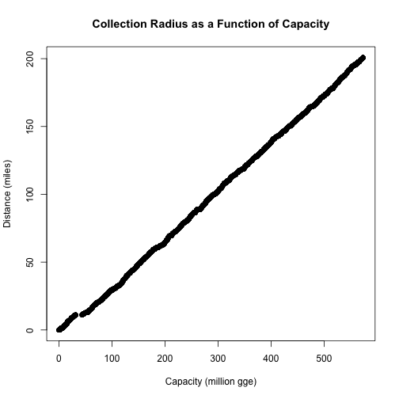
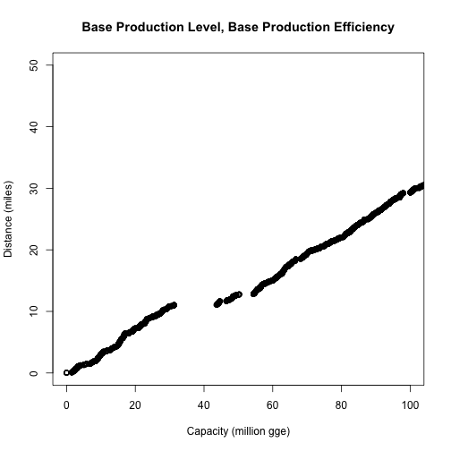
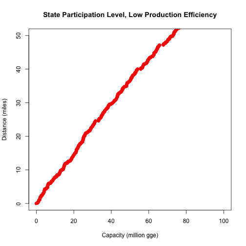
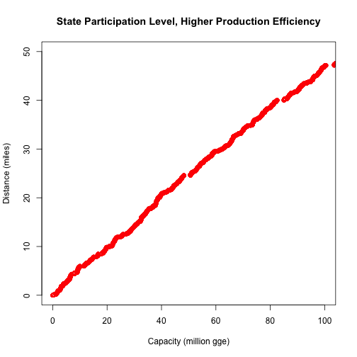
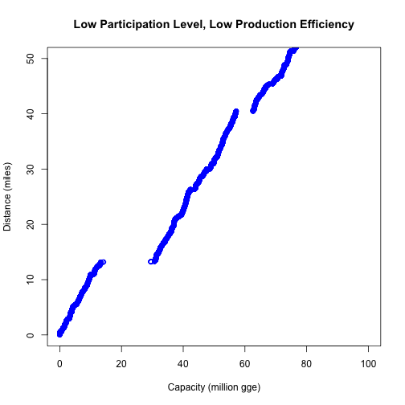
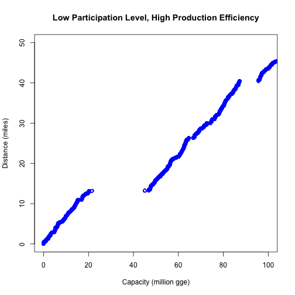

Data analysis for corn stover supply system comparison
========================================================

To get an idea of the distribution of available stover around the biorefinery, estimations of the yield and area harvested are first developed using statewide data available from the National Agricultural Statistics Service.  An important distinction between the data for yields and for area harvested is that individual yield values are available at the county level while county level area harvested values are interval censored.

For Iowa yields, data is selected from the years 2004 through 2013.  These years were chosen so that years were comparable.  Prior to this time period, yield increases due to techonlogical advances were more significant.  A scaled beta distribution is fit to the data, with the support determined by the minimum and maximum values which actually occured.


```r
remove(list = ls())

# reading in the data
c <- "/Users/goodrich/Desktop/R Projects/Supply.Chain.Development/Iowa_corn_data_2.csv"
iowa.data <- read.table(file = c, header = TRUE, sep = ",")

# extracting yield data from 2004-2013
iowa.yield <- subset(iowa.data, Data.Item == "CORN, GRAIN - YIELD, MEASURED IN BU / ACRE")
iowa.yield <- subset(iowa.yield, Year > 2003)

# removing unnecessary variables from extraction
iowa.yield <- subset(iowa.yield, select = c(Year, County, Value))

# converting values to numeric
iowa.yield$Value <- as.numeric(as.character(iowa.yield$Value))

# calculating the support of yield variable
l <- min(iowa.yield$Value)
u <- max(iowa.yield$Value)

# transform data to standard beta distribution
iowa.yield$trans <- (iowa.yield$Value - l)/(u - l)

# method of moments estimation
mu <- mean(iowa.yield$trans)
s2 <- var(iowa.yield$trans)
beta <- mu * (1 - mu)^2/s2 - (1 - mu)
alpha <- beta * mu/(1 - mu)

hist(iowa.yield$trans, breaks = 16, main = "Histogram of Transformed Yield Values", 
    freq = FALSE, xlab = "Transformed yield")
curve(dbeta(x, alpha, beta), add = TRUE, col = "blue", lwd = 3)
```

 


An initial investigation of the statewide values for farmers harvested between 0 and 25 acres, 25 and 100 acres, 100 and 250 acres, 250 and 500 acres, 500 and 1000 acres, and more than 1000 acres indicates that the distribution is unimodal and skewed right.  This suggests the appropriateness of a $lognormal(\mu,\sigma^2)$ distribution whose parameters can be found through the use of a Gibb sampler.  To find appropriate values for the prior distributions on the lognormal parameters a percentile matching technique is first used.  In particular, excel's solver is used to find the values for $\mu$ and $\sigma^2$ which minimize the sum of the squared differences between the percentile of the data and the percentile of the distribution subject to the constraint that the mean of the distribution equals the statwide mean area harvested.


```r
# reading in the farm size data
o <- "/Users/goodrich/Desktop/R Projects/Supply.Chain.Development/Iowa_operations.csv"
operations.data <- read.table(file = o, header = TRUE, sep = ",")
operations.2007 <- subset(operations.data, Year == 2007)
op <- function(data) {
    with(data, sum(Value))
}

require(plyr)
```

```
## Loading required package: plyr
```

```r
op.dist.2007 <- ddply(operations.2007, .variables = "Domain.Category", .fun = op)

# --setting up matrix for comparison of data and model--#
total_operations <- sum(op.dist.2007$V1)

perc <- function(data) {
    with(data, V1/total_operations)
}

model_check <- matrix(data = NA, nrow = 6, 5)
colnames(model_check) <- c("ID", "Farm_Size", "Data_Percentile", "Model_Percentile", 
    "Squared_Diff")
data_perc <- ddply(op.dist.2007, .variables = "Domain.Category", .fun = perc)
model_check[, 2] <- as.character(data_perc$Domain.Category)
model_check[, 3] <- round(data_perc[, 2], 4)

# renaming category variables
model_check[1, 2] <- "1000 or more acres"
model_check[2, 2] <- "1 to 24.9 acres"
model_check[3, 2] <- "100 to 249 acres"
model_check[4, 2] <- "25 to 99.9 acres"
model_check[5, 2] <- "250 to 499 acres"
model_check[6, 2] <- "500 to 999 acres"

# setting ID variables
model_check[1, 1] <- 6
model_check[2, 1] <- 1
model_check[3, 1] <- 3
model_check[4, 1] <- 2
model_check[5, 1] <- 4
model_check[6, 1] <- 5

# ordering according to ID
model_check <- model_check[order(model_check[, 1]), ]

# --setting the parameters of the lognormal function--# Excel solver output
mu = 155.8869
sigma = 3.428357

# checking the fit of the parameters
acres <- rlnorm(1e+05, meanlog = log(mu), sdlog = log(sigma))
model_check[1, 4] <- round(plnorm(25, meanlog = log(mu), sdlog = log(sigma), 
    lower.tail = TRUE), 4)
model_check[2, 4] <- round(plnorm(100, meanlog = log(mu), sdlog = log(sigma), 
    lower.tail = TRUE) - plnorm(25, meanlog = log(mu), sdlog = log(sigma), lower.tail = TRUE), 
    4)
model_check[3, 4] <- round(plnorm(250, meanlog = log(mu), sdlog = log(sigma), 
    lower.tail = TRUE) - plnorm(100, meanlog = log(mu), sdlog = log(sigma), 
    lower.tail = TRUE), 4)
model_check[4, 4] <- round(plnorm(500, meanlog = log(mu), sdlog = log(sigma), 
    lower.tail = TRUE) - plnorm(250, meanlog = log(mu), sdlog = log(sigma), 
    lower.tail = TRUE), 4)
model_check[5, 4] <- round(plnorm(1000, meanlog = log(mu), sdlog = log(sigma), 
    lower.tail = TRUE) - plnorm(500, meanlog = log(mu), sdlog = log(sigma), 
    lower.tail = TRUE), 4)
model_check[6, 4] <- round(plnorm(1000, meanlog = log(mu), sdlog = log(sigma), 
    lower.tail = FALSE), 4)

model_check[, 5] <- round((as.numeric(model_check[, 3]) - as.numeric(model_check[, 
    4]))^2, 4)

model_check
```

```
##      ID  Farm_Size            Data_Percentile Model_Percentile
## [1,] "1" "1 to 24.9 acres"    "0.0999"        "0.0687"        
## [2,] "2" "25 to 99.9 acres"   "0.2619"        "0.2906"        
## [3,] "3" "100 to 249 acres"   "0.2787"        "0.29"          
## [4,] "4" "250 to 499 acres"   "0.2026"        "0.1786"        
## [5,] "5" "500 to 999 acres"   "0.1154"        "0.1064"        
## [6,] "6" "1000 or more acres" "0.0415"        "0.0657"        
##      Squared_Diff
## [1,] "0.001"     
## [2,] "8e-04"     
## [3,] "1e-04"     
## [4,] "6e-04"     
## [5,] "1e-04"     
## [6,] "6e-04"
```

```r
mean(acres)  #actual mean is 333
```

```
## [1] 335
```


Since this percentile matching technique only provides point estimates, a Gibbs sampler is used to estimate the uncertainty of $\mu$ and $\sigma^2$.


```r
require(rjags)
```

```
## Loading required package: rjags
## Loading required package: coda
## Loading required package: lattice
## Linked to JAGS 3.3.0
## Loaded modules: basemod,bugs
```

```r
load.module("bugs")
area_dummy <- as.data.frame(c(rep(0, 504), rep(1, 13122), rep(2, 13962), rep(3, 
    10149), rep(4, 5779), rep(5, 2079)))
colnames(area_dummy) <- "dummy"
area_dummy$na <- rep(NA, nrow(area_dummy))

model = "\nmodel{\n  for(i in 1:n){\n  #piecewise distribution\n  branch[i,1]~dnorm(mu,1/sigma2)T(log(1000),)\n  branch[i,2]~dnorm(mu,1/sigma2)T(log(500),log(1000))\n  branch[i,3]~dnorm(mu,1/sigma2)T(log(250),log(500))\n  branch[i,4]~dnorm(mu,1/sigma2)T(log(100),log(250))\n  branch[i,5]~dnorm(mu,1/sigma2)T(log(25),log(100))\n  branch[i,6]~dnorm(mu,1/sigma2)T(0,log(25))\n  \n  #determining bin    \n  if_result[i]<-1+step(d[i]-5)+step(d[i]-4)+step(d[i]-3)+step(d[i]-2)+step(d[i]-1)\n  a[i]<-branch[i,if_result[i]]  \n}\n\n  mu~dnorm(log(155.8869),1/log(20))T(0,)\n  sigma2~dgamma(2,log(3.428357))\n}"
dat = list(n = nrow(area_dummy), d = area_dummy$dummy, a = area_dummy$na)
m = jags.model(textConnection(model), dat, quiet = TRUE)

# samples
iter <- 10000
results = coda.samples(m, c("mu", "sigma2"), iter)

# diagnostics
plot(results, trace = TRUE)
```

 

```r

# mean moments
log_mean <- mean(unlist(results[, "mu"]))
log_mean_var <- var(unlist(results[, "mu"]))
mean_moments <- list(log_mean, log_mean_var, n = iter)

# variance
log_var <- mean(unlist(results[, "sigma2"]))
log_sd <- sqrt(log_var)

# move towards original scale--done incorrectly.  I need to move this within
# the sampler
acres_mean <- exp(log_mean + log_var/2)
acres_sd <- (exp(2 * log_mean + 2 * log_var) - exp(2 * log_mean + log_var))^0.5
```


```r
# radius calculation
Iowa_area = 56271.55
r = (Iowa_area/pi)^(1/2)

# assumed parameters
HI <- 0.5
dgm <- 21.5
theta <- 0.23
w_factor <- 1.5
b <- 0.3
eg <- 120
ee <- (2/3) * eg
es <- 19.5
btl <- 0.48

theta2 <- 0.17
theta3 <- 0.125
btl2 <- 0.38
btl3 <- 0.58

# number of farmers to generate
n = total_operations

# --BASE CASE--# data set up
stover_data0 <- as.data.frame(matrix(NA, n, 2))

for (i in 1:n) {
    stover_data0[i, 1] <- runif(1, 0, r * w_factor)
    acres <- rlnorm(1, log_mean, log_var)
    x <- rbeta(1, alpha, beta)
    p <- rbinom(1, 1, theta)
    stover_data0[i, 2] <- (l + (u - l) * x) * ((1 - HI)/HI) * dgm * b * p * 
        acres
}

# ordering according to distance
stover_data0 <- as.data.frame(stover_data0[order(stover_data0[, 1]), ])

# calculating the available stover as a function of distance
stover_data0$cumulative_stover <- NA
for (i in 1:nrow(stover_data0)) {
    stover_data0[i, 3] <- sum(stover_data0[1:i, 2])
}

# calculating production capacity as a function of stover, distance
stover_data0$Capacity <- NA

for (i in 1:nrow(stover_data0)) {
    stover_data0[i, 4] <- round(stover_data0[i, 3] * btl * es/eg)
}

stover_data0$Cap_Mil <- stover_data0$Capacity/1e+06
plot(stover_data0$Cap_Mil, stover_data0$V1, ylab = "Distance (miles)", xlab = "Capacity (million gge)", 
    main = "Collection Radius as a Function of Capacity")
```

 

```r
plot(stover_data0$Cap_Mil, stover_data0$V1, ylab = "Distance (miles)", xlab = "Capacity (million gge)", 
    ylim = c(0, 50), xlim = c(0, 100), main = "Base Production Level, Base Production Efficiency")
```

 

```r

# lower production efficiency scenario
stover_data0$Capacity_low <- NA

for (i in 1:nrow(stover_data0)) {
    stover_data0[i, 6] <- round(stover_data0[i, 3] * btl2 * es/eg)
}
stover_data0$Cap_Mil_low <- stover_data0$Capacity_low/1e+06
plot(stover_data0$Cap_Mil_low, stover_data0$V1, ylab = "Distance (miles)", xlab = "Capacity (million gge)", 
    ylim = c(0, 50), xlim = c(0, 100), main = "Base Participation, Low Production Efficiency")
```

 

```r

# higher production efficiency scenario
stover_data0$Capacity_high <- NA

for (i in 1:nrow(stover_data0)) {
    stover_data0[i, 8] <- round(stover_data0[i, 3] * btl3 * es/eg)
}
stover_data0$Cap_Mil_high <- stover_data0$Capacity_high/1e+06
plot(stover_data0$Cap_Mil_high, stover_data0$V1, ylab = "Distance (miles)", 
    xlab = "Capacity (million gge)", ylim = c(0, 50), xlim = c(0, 100), main = "Base Participation, High Production Efficiency")
```

 

```r

# --THETA LOWERED TO STATEWIDE INTEREST LEVEL--#
stover_data1 <- as.data.frame(matrix(NA, n, 2))

for (i in 1:n) {
    stover_data1[i, 1] <- runif(1, 0, r * w_factor)
    acres <- rlnorm(1, log_mean, log_var)
    x <- rbeta(1, alpha, beta)
    p <- rbinom(1, 1, theta2)
    stover_data1[i, 2] <- (l + (u - l) * x) * ((1 - HI)/HI) * dgm * b * p * 
        acres
}

stover_data1 <- as.data.frame(stover_data1[order(stover_data1[, 1]), ])

stover_data1$cumulative_stover <- NA
for (i in 1:nrow(stover_data1)) {
    stover_data1[i, 3] <- sum(stover_data1[1:i, 2])
}

stover_data1$Capacity <- NA
for (i in 1:nrow(stover_data1)) {
    stover_data1[i, 4] <- round(stover_data1[i, 3] * btl * es/eg)
}
stover_data1$Cap_Mil <- stover_data1$Capacity/1e+06
plot(stover_data1$Cap_Mil, stover_data1$V1, ylab = "Distance (miles)", xlab = "Capacity (million gge)", 
    col = "red", ylim = c(0, 50), xlim = c(0, 100), main = "State Participation Level, Base Production Efficiency")
```

 

```r

# lower production efficiency scenario
stover_data1$Capacity_low <- NA

for (i in 1:nrow(stover_data0)) {
    stover_data1[i, 6] <- round(stover_data1[i, 3] * btl2 * es/eg)
}
stover_data1$Cap_Mil_low <- stover_data1$Capacity_low/1e+06
plot(stover_data1$Cap_Mil_low, stover_data1$V1, ylab = "Distance (miles)", xlab = "Capacity (million gge)", 
    ylim = c(0, 50), xlim = c(0, 100), main = "State Participation Level, Low Production Efficiency", 
    col = "red")
```

 

```r

# higher production efficiency scenario
stover_data1$Capacity_high <- NA

for (i in 1:nrow(stover_data0)) {
    stover_data1[i, 8] <- round(stover_data1[i, 3] * btl3 * es/eg)
}
stover_data1$Cap_Mil_high <- stover_data1$Capacity_high/1e+06
plot(stover_data1$Cap_Mil_high, stover_data1$V1, ylab = "Distance (miles)", 
    xlab = "Capacity (million gge)", ylim = c(0, 50), xlim = c(0, 100), main = "State Participation Level, Higher Production Efficiency", 
    col = "red")
```

 

```r

# --THETA LOWERED TO 1/2 BASE CASE--#
stover_data2 <- as.data.frame(matrix(NA, n, 2))

for (i in 1:n) {
    stover_data2[i, 1] <- runif(1, 0, r * w_factor)
    acres <- rlnorm(1, log_mean, log_var)
    x <- rbeta(1, alpha, beta)
    p <- rbinom(1, 1, theta3)
    stover_data2[i, 2] <- (l + (u - l) * x) * ((1 - HI)/HI) * dgm * b * p * 
        acres
}

stover_data2 <- as.data.frame(stover_data2[order(stover_data2[, 1]), ])

stover_data2$cumulative_stover <- NA
for (i in 1:nrow(stover_data2)) {
    stover_data2[i, 3] <- sum(stover_data2[1:i, 2])
}

stover_data2$Capacity <- NA
for (i in 1:nrow(stover_data2)) {
    stover_data2[i, 4] <- round(stover_data2[i, 3] * btl * es/eg)
}
stover_data2$Cap_Mil <- stover_data2$Capacity/1e+06
plot(stover_data2$Cap_Mil, stover_data2$V1, ylab = "Distance (miles)", xlab = "Capacity (million gge)", 
    col = "blue", ylim = c(0, 50), xlim = c(0, 100), main = "Low Participation, Base Production Efficiency")
```

 

```r

# lower production efficiency scenario
stover_data2$Capacity_low <- NA

for (i in 1:nrow(stover_data0)) {
    stover_data2[i, 6] <- round(stover_data2[i, 3] * btl2 * es/eg)
}
stover_data2$Cap_Mil_low <- stover_data2$Capacity_low/1e+06
plot(stover_data2$Cap_Mil_low, stover_data2$V1, ylab = "Distance (miles)", xlab = "Capacity (million gge)", 
    ylim = c(0, 50), xlim = c(0, 100), main = "Low Participation Level, Low Production Efficiency", 
    col = "blue")
```

 

```r

# higher production efficiency scenario
stover_data2$Capacity_high <- NA

for (i in 1:nrow(stover_data0)) {
    stover_data2[i, 8] <- round(stover_data2[i, 3] * btl3 * es/eg)
}
stover_data2$Cap_Mil_high <- stover_data2$Capacity_high/1e+06
plot(stover_data2$Cap_Mil_high, stover_data2$V1, ylab = "Distance (miles)", 
    xlab = "Capacity (million gge)", ylim = c(0, 50), xlim = c(0, 100), main = "Low Participation Level, High Production Efficiency", 
    col = "blue")
```

 

